# 
cyberdog_bringup design document

##  Directory 
* [1. Revise](#1-revise)
* [2. Overview](#2-overview)
* [3. Design](#3-design)
    * [3.1. Feature design](#31-feature-design)
    * [3.2. modular design](#32-modular-design)
---
## 1. Revise

Item|Software Version|Protocol Version|Revision Date|Reviser|Remarks
:--:|:--|:--|:--:|:--:|:--:
bringup|V1.1.0.0|V1.0.0.0|2023-02-06|ShangZihan|none

## 2. Overview
The main functions of bringup are as follows:
1. All configured nodes in the robot can be started according to the parameters in the target configuration file (*.yaml);
2. Dynamically start/stop certain nodes (currently only navigation2 is required);
3. The configuration file is adapted to the internal interface of ROS2 launch as fully as possible;

## 3. Design
### 3.1. Feature design

There are two types of bringup startup constraints, namely configuration files (*.yaml) and command line startup parameters (argv[]), among which:
1. The configuration file (*.yaml) has a unique main file, and the parameters in other sub-files that meet the ros constraints can be loaded in the main file;
2. The command line startup parameters (argv[]) adapt to the ROS2 launch parameter interface.

Consider the following issues regarding the presentation of the startup file:
1. The startup constraint is not visible to the user when it is dynamically loaded into the memory at runtime, which is not easy to troubleshoot and analyze;
2. The only startup file cannot be started multiple times at the same time, which is not easy to troubleshoot and analyze.

Therefore, the startup constraints will be statically exhausted, and dynamic loading at runtime should be avoided as much as possible, thus:
1. The startup file will be dynamically generated according to the configuration file (*.yaml) when cyberdog_bringup is compiled;
2. And the parameters are exhausted as much as possible, but the dynamic parameter entry will also flow out.
3. The startup file has a unique main file, which is responsible for starting all nodes under the constraints of parameters;
4. The start-up file has sub-files of different levels, which are responsible for starting the corresponding nodes under the constraints of parameters.

### 3.2 Technology architecture

- cyberdog_bringup dynamically generates the required launch.py files at various levels according to the configuration files (bringup.yaml, launch.yaml, node.yaml).
- The automatically generated launch.py file will load the manually created yaml file or launch file according to the configuration parameters to achieve flexible configuration.
- Finally, according to the configuration, the unique launch.py for starting all nodes of the robot can be realized, which is used for system-level service calls, so as to realize the automatic startup function of the robot software function.

The implementation plan is simply divided into the following 5 steps:
1. Classify and abstract the complex and lengthy grammar, extract the links that must be manually coded and highly abstract it into a self-defined meta-language;
2. Use a certain coding style (such as toml, yaml, json, etc.) to code the custom meta-language;
3. Write compilation tools for the coding style and meta-language determined above, that is, the program for the robot to realize the automatic coding function;
4. At each compilation, automatically compile the meta-language, generate an executable script, and install it;
5. Set the boot to start through the system command.
